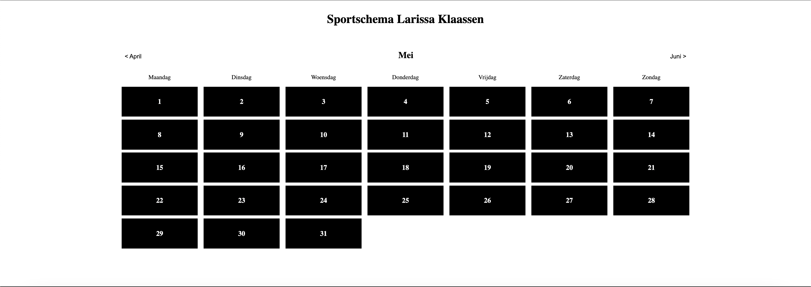
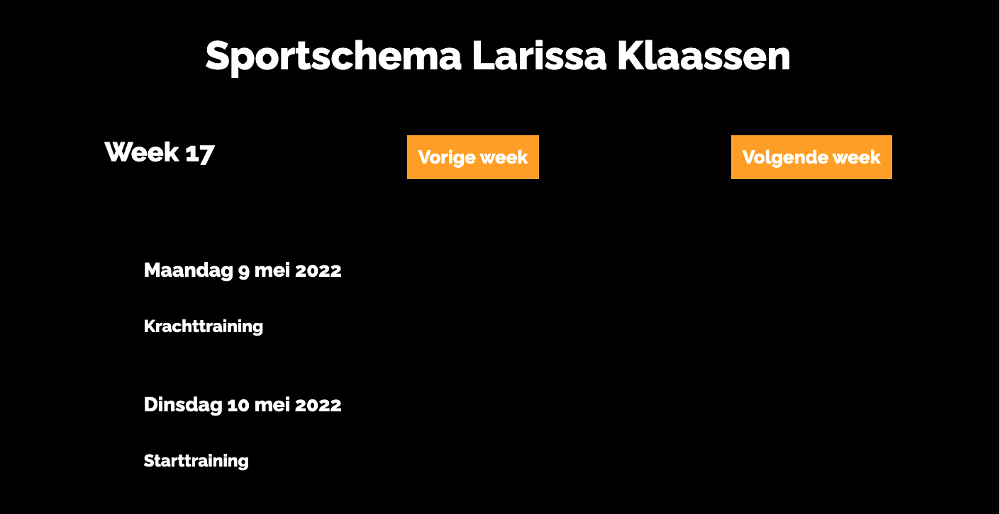
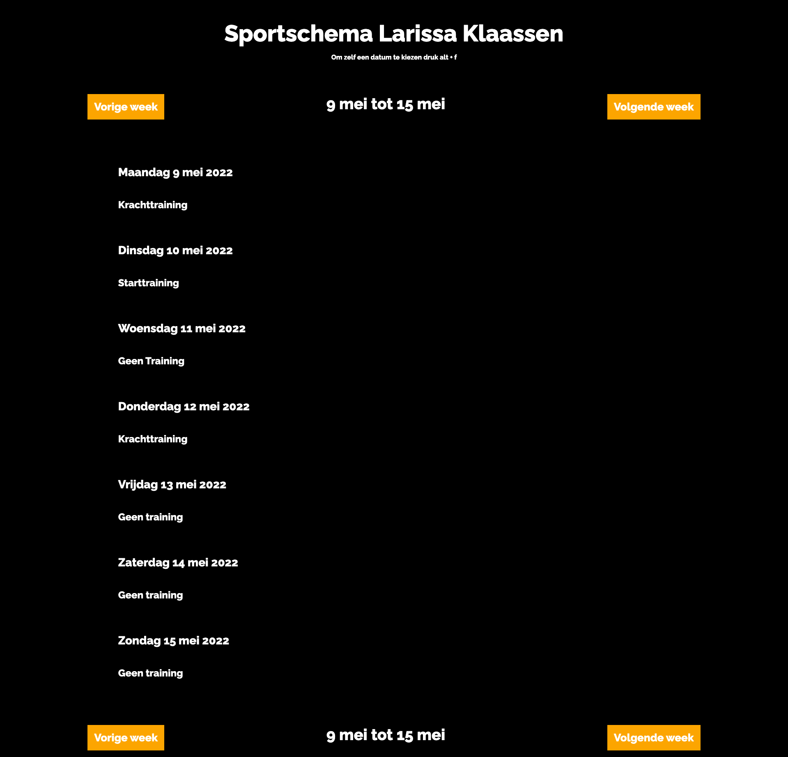

# Sportschema Larissa Klaassen

Topsporter Larissa Klaassen is slechtziend. Ze is bijna blind, maar ziet nog kleuren met hoog contrast en daardoor lichtelijk vormen. Larissa's coach stuurde haar eerst altijd een sportschema op (inmiddels niet meer omdat ze er toch niet naar luisterd). Het nadeel van zo'n sportschema is dat het voor Larissa totaal niet prettig "te lezen" is. Daarom moet zij een nieuw sportschema krijgen die met een screenreader goed te lezen is. Een website is daarom voor haar misschien de beste optie.

## Testen

### Test 1
Voor test 1 hebben we nog niet heel veel kunnen maken omdat we vrij weinig informatie hadden. Ik had een opzetje gemaakt van een maand schema:

#### Algemene inzichten
- Larissa is niet helemaal blind. Ze ziet nog wel contrasten en daardoor vormen. Ze heeft een voorkeur voor een donkere achtergrond met  daarover felle kleuren. Ze houdt van de kleur oranje. Deze informatie kan handig zijn voor het kleurenschema van de website.
- Aangezien Larissa het scherm nog wel kan zien, is het voor haar ook prettig om wat te zien gebeuren als ze naar een website kijkt. Het geeft haar een extra houvast. Dit maakt het voor haar wel belangrijke feedback.
- Ze is erg zelfstandig. Ze woont dan ook alleen met een hulphond. Ook haar laptop kan ze helemaal zelfstandig besturen en gebruiken.
- Ze heeft een normale laptop met screenreader software: JAWS / NVDA
- Haar screenreader heeft de spreker 'Claire - NL dames'. Deze is voor haar erg toegankelijk.
- Ze heeft een braille leesregel voor haar laptop, maar ze gebruikt hem eigenlijk nooit.
- Ze is erg visueel ingesteld.
- Een lettertype zo simpel mogelijk is voor haar prettig zodat ze nog wel iets van het lettertype kan zien.
- Larissa is totaal niet geordend. Thuis laat ze alles overal slingeren. 'Als het niet op mijn rommelhoop ligt, ben ik het kwijt'.
- Ze wil de informatie op een website zo snel mogelijk krijgen. Ze neem niet de tijd om heel lang op een element te zitten.
- Ze kan onderdelen zien, dus veel ruimte tussen html elementen is voor haar prettig. Dan kan ze nog een soort structuur in de website zien.

#### Testen
- Voor het maandoverzicht heb ik de dagen in een `<ul>` gewrapt waarin elke dag een `<li>` is. De screenreader las het voor als: 'lijst, 31 elementen'. Dat kwam voor haar nogal overwelmend over. Het gebruik van een lijst is daarom niet de beste optie.
- De screenreader leest van links naar rechts, dus het las eerst 'Maandag, Dinsdag, Woensdag, Donderdag, Vrijdag, Zaterdag, Zondag' voordat deze naar de dagen zelf ging. Na veel elementen kwam ze uiteindelijk aan bij de dagen zelf. Ze vertelde dat het voor haar te lang duurt en ze liever zo snel mogelijk bij de dagen terecht komt.
- De tekst was te klein. Zoals eerder vernoemd mag alles lekker ruim en groot aangegeven worden.
- De kleuren zijn nu zwart op wit, andersom is prettiger.

#### Conclusie
Een maandoverzicht is niet helemaal geschikt voor haar. Het zijn veel elementen die dicht op elkaar zitten en er komt al snel meer informatie naar boven dan ze nodig heeft. Mijn focus wordt om te kijken naar een weekschema en deze zo prettig en ruim mogelijk te weergeven.

### Test 2
Voor test 2 heb ik een weekoverzicht gemaakt. Helaas had ik slechts een ochtend om eraan te werken waardoor ik geen volledig werkend prototype had kunnen tonen, maar slechts een niet interactieve voorpagina waar ze nog wel doorheen kon tabben.

#### Algemene inzichten
- Normaal heeft ze een sportschema per wedstrijdseizoen. Dus tot het volgende kampioenschap.
- Gebruikt Training Peaks (coach maakt geen schema’s meer voor haar)
- Larissa heeft vaste trainingen in de week, de rest is afstemmen per periode. Ook deels op gevoel trainen. Haar sportschema ziet er wekelijks deels hetzelfde eruit.
- Ze vindt het prettig om in een schema te zien hoeveel ze per dag moet doen en hoelang.
- Ze gebruikt altijd tab om door een website te gaan. Ze gebruikt eigenlijk nooit de pijltjes. Daarnaast vindt ze het ook prettig om dingen in een website op te zoeken in een inputveld. Zo hoeft ze niet de hele website af om iets te vinden.

#### Testen
- Heel veel mensen die bij Larissa zitten hadden een klein onopvallend foutje gemaakt. De taal van de website op Nederlands zetten. Hier wees zij op.
- Ze vond een weekoverzicht prettig. Zo kan ze snel de details van een dag in, maar alsnog ook makkelijk elke datum vinden.
- Ze heeft liever in de weeknavigatie dat de week in het midden staat i.p.v rechts. Zo kan ze makkelijker de week weten als ze op vorige of volgende drukt.
- Ze weet nooit welk weeknummer het is. Misschien is het daarom handig om gewoon de eerste en laatste dag van de week te noemen. Bijvoorbeeld 1 april tot 7 april.
- Het zou ook fijn zijn als de weeknavigatie nogmaals aan de onderkant staat. Dan hoeft ze niet terug naar boven te tabben.

#### Conclusie
Ik ben goed op weg. Ik denk dat een weekoverzicht voor haar vrij prettig is. Naast de feedback die ze gaf tijdens het testen, ga ik ook luisteren naar dingen die ze in het algemeen heeft verteld. Een zoekfunctie zodat ze naar een specifieke datum kan zoeken lijkt mij een goede toevoeging.

### Test 3
Voor test 3 ben ik verder gaan werken aan het weekoverzicht. Ik heb een functie gemaakt waardoor zij kan zoeken naar elke datum door de toets 'f' in te drukken. Zo kan ze altijd zoeken naar een datum, desondanks haar positie in de website.

#### Testen
- Ze vond het idee van een datum kiezen door een toets in te drukken een ontzettend goed idee. Haar screenreader programma 'JAWS' gebruikt wel al heel veel toetsen. Daarom is een toetscombinatie zoals `alt + ctrl + f` of `alt + f` beter.
- Ook moeten er meer instructies komen over welke toets ze moet indrukken. Dat ontbreekt nu.
- Er mist nog wat contrast bij focus. Nu gebeurd er nog wat weinig op het scherm voor haar.
- Wat belangrijk hierbij is is een wedstrijdenoverzicht zodat ze weet waarvoor ze traint.
- Meer details over de training vrijgeven op klik.
- Wat prettig zou zijn is een functie om zelf trainingen toe te voegen aan een dag.

#### Conclusie
Larissa ging erg vloeiend door de website heen en begreep direct waar elk gebied voor bedoeld was. Ze mistte nog een aantal dingen waar ik nu niet de tijd meer voor heb om nog toe te voegen. Deze zijn echter zeker genoteerd en komt mooi in mijn toekomstplan te staan.

## Eindconcept
De oplossing voor Larissa's probleem is een website met een weekkalender waar ze trainingen kan inzien en toevoegen.

### Huidige features
- Druk `alt + f` in om direct een datum te kunnen zoeken.
- Een weekoverzicht met wat voor training er is.
- 2 navigatiebalken om boven- en onderaan de pagina naar een andere week te kunnen gaan.

### Features waar ik geen tijd voor had (toekomstvisie)
- Wedstrijdenoverzicht
- Meer details over elke training als je erop klikt
- Nieuwe training toevoegen

### Design Principles

#### Study Situation
Larissa heeft een hele specifieke manier waarop zij haar laptop gebruikt en hoe zij op dingen reageert. Daarom was het belangrijk om goed haar gedrag te observeren en haar te vragen hoe zij er het liefst mee om gaat. Ik kan niet zomaar uitgaan van wat haar gedrag is en daarop mijn design baseren.

#### Ignore Conventions
Ik ben met HTML gewend om heel semantisch te werken. Alles moet netjes volgens de HTML regels voor een zo strak mogelijke code. Maar voor Larissa is dat helemaal niet goed. Larissa is een vrij druk en ongeduldig persoon. Zij wil zo snel mogelijk informatie krijgen. Sommige HTML elementen zorgen ervoor dat haar flow onderbroken wordt. Daarom moest ik afstappen van de semantiek en een vreemdere code schrijven die voor haar beter werkt.

#### Prioritise Identity
In plaats van dat ik zelf een toetscombinatie voor het zoeken naar een datum verzon, vroeg ik juist aan Larissa wat zij een prettige toetscombinatie vindt en die nog beschikbaar is. Ik design voor Larissa. Daarom heeft Larissa veel meer zeg wat er gebeurd met de website dan ik. Ik probeerde haar daarom zo goed mogelijk te betrekken bij ontwerpkeuzes.

#### Add Nonsense
Het enige speelse (en onnodige) wat ik heb kunnen toevoegen is de kleur oranje. Ze is Nederlands kampioen en houdt daarom van deze kleur. Ik had heel graag meer speelse elementen willen toevoegen, maar mijn tijd was op. Mogelijke speelse dingen die ik had kunnen toevoegen zouden zijn:
- Geluid van een fluidje als ze een nieuwe training toevoegd
- Geluid van gejuig als een dag voorbij is.
- Meer wisselingen in kleuren

